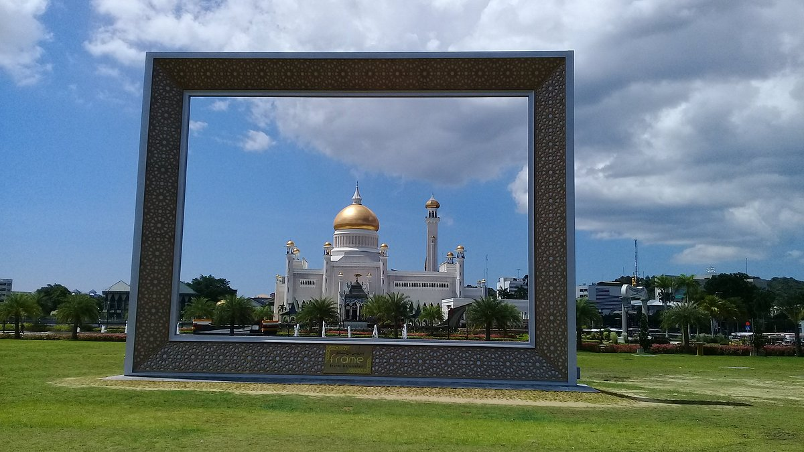

# Introduction
This is the source code for the project of 
SDS-UBD module, ZC-4301 - Computer Graphics.

> Disclaimer:
>
> This repo will be made public until 2024/12/01 (1st December 2024), and is used as reference only.

> Instructions for this project can be found 
> in the [Instructions Markdown File](Documentation/Instructions.md).

## Topic chosen
The topic chosen for this project is **Topic 1: Virtual Bruneian Landmark Tour**,
with chosen landmark being the BIBD Frame Brunei Darussalam, located in *Eco Corridor Park
/ Taman Mahkota Jubli Emas*. 

The inspiration for this graphical design is based on the photo below:

Picture 01: Inspiration Picture
